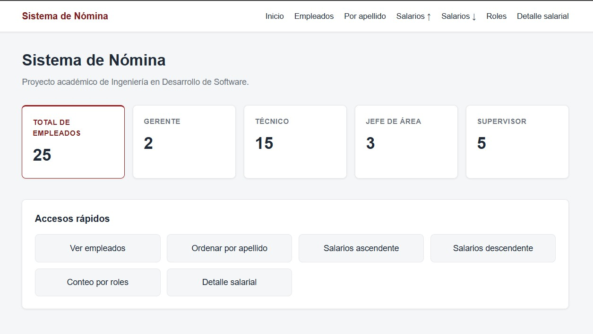

# Sistema de Nómina de Empleados

## 1. Descripción breve

Este proyecto es un **sistema académico de nómina** desarrollado en Java para la carrera de Ingeniería en Desarrollo de Software. Permite gestionar una nómina inicial de empleados, calcular descuentos de **ISSS**, **AFP** y **renta**, y consultar la información mediante dos interfaces:

- **Interfaz de consola** para operaciones interactivas por menú.
- **Interfaz web** para visualizar empleados, ordenamientos y detalles salariales.

Ambas interfaces reutilizan la **misma lógica de negocio** (`NominaService`), sin duplicar cálculos ni reglas de descuento.

El sistema aplica principios **SOLID** y patrones de diseño como **Strategy**, **Repository**, **Service Layer**, **Command**, **Factory/Seeder** y **Domain Model**.

---

## 2. Tecnologías utilizadas

| Tecnología | Uso |
|---|---|
| Java | Lenguaje principal del sistema |
| Spring Boot | Framework para la aplicación web |
| Maven | Gestión del proyecto, dependencias y compilación |
| Thymeleaf | Renderizado de vistas HTML del lado del servidor |
| HTML | Estructura de las páginas web |
| SASS (SCSS) | Estilos fuente compilados a CSS |
| CSS | Hoja de estilos servida por la aplicación web |
| JUnit 5 | Pruebas unitarias |
| Git | Control de versiones del proyecto |

---

## 3. Versiones necesarias

| Herramienta | Versión recomendada |
|---|---|
| Java (JDK) | **21** (configurado en `pom.xml`) |
| Spring Boot | **4.1.0** |
| Maven Wrapper | **3.3.4** (incluido en el proyecto; distribuye Maven **3.9.16**) |
| Node.js | **v22.12.0** (descargado automáticamente por Maven al compilar SASS) |
| npm | Incluido con Node.js mediante `frontend-maven-plugin` |
| Dart Sass | **^1.83.0** (dependencia en `package.json`) |

> **Nota:** No es obligatorio instalar Maven ni Node.js manualmente para compilar el proyecto. El **Maven Wrapper** (`mvnw.cmd`) descarga Maven y, durante el build, el plugin frontend instala Node.js para compilar los estilos SASS.

---

## 4. Requisitos previos

Antes de ejecutar el proyecto, asegúrate de contar con lo siguiente:

1. **JDK 21** (o compatible con la versión configurada en `pom.xml`).
2. Variable de entorno **`JAVA_HOME`** apuntando a tu instalación del JDK.
3. **Maven Wrapper** del proyecto (`mvnw.cmd` en Windows).
4. Un **navegador web** para probar la interfaz web.
5. **Node.js/npm** solo si deseas ejecutar `sass:watch` manualmente durante el desarrollo de estilos. Para compilar con Maven, no es necesario instalarlos por separado.

### Verificar Java

En PowerShell:

```powershell
java -version
```

Deberías ver una salida similar a Java 21 o superior.

### Verificar que estás en la raíz del proyecto

```powershell
cd ruta\al\proyecto\sistema-nomina
```

---

## 5. Compilación del proyecto

Para compilar el proyecto y generar los estilos CSS desde SASS:

```powershell
.\mvnw.cmd compile
```

Para compilar y ejecutar las pruebas unitarias:

```powershell
.\mvnw.cmd test
```

---

## 6. Ejecución de la aplicación web

Levantar el servidor Spring Boot:

```powershell
.\mvnw.cmd spring-boot:run
```

Cuando la aplicación esté en ejecución, abre el navegador en:

**http://localhost:8080/**

### Rutas web disponibles

| Ruta | Descripción |
|---|---|
| `/` | Dashboard con resumen de empleados y accesos rápidos |
| `/empleados` | Listado de todos los empleados |
| `/empleados/apellidos` | Empleados ordenados por primer apellido |
| `/empleados/salarios/asc` | Empleados ordenados por salario neto ascendente |
| `/empleados/salarios/desc` | Empleados ordenados por salario neto descendente |
| `/empleados/roles` | Cantidad de empleados por rol |
| `/empleados/detalles-salarios` | Detalle salarial completo (ISSS, AFP, renta, descuentos y neto) |

### Vista previa de la interfaz web



---

## 7. Ejecución de la interfaz de consola

La consola se ejecuta de forma independiente a la aplicación web y consume la misma lógica de negocio.

### Desde terminal (Maven)

```powershell
.\mvnw.cmd exec:java
```

### Desde el IDE

Ejecutar la clase `sv.edu.ues.nomina.console.MainConsola`.

### Menú de consola

Al iniciar la consola, deberías ver un menú similar a este:

```
========================================
      SISTEMA DE NÓMINA - CONSOLA
========================================
1. Mostrar todos los empleados
2. Ordenar empleados por primer apellido
3. Ordenar empleados por salario neto ascendente
4. Ordenar empleados por salario neto descendente
5. Mostrar cantidad de empleados por rol
6. Mostrar detalle salarial completo
0. Salir
========================================
Seleccione una opción:
```

El programa permanece activo hasta que el usuario seleccione la opción **0 (Salir)**.

---

## 8. Desarrollo de estilos (opcional)

Los estilos fuente están en `src/main/sass/styles.scss` y se compilan automáticamente durante el build de Maven.

Si deseas recompilar SASS en tiempo real mientras editas estilos:

```powershell
npm run sass:watch
```

---

## 9. Estructura general del proyecto

```
sistema-nomina/
├── src/main/java/sv/edu/ues/nomina/
│   ├── domain/          # Modelo de dominio (Empleado, roles, detalles)
│   ├── service/         # Lógica de negocio y estrategias de descuento
│   ├── repository/      # Almacenamiento en memoria
│   ├── data/            # Datos iniciales (Seeder)
│   ├── factory/         # Ensamblado de dependencias
│   ├── config/          # Configuración Spring para la web
│   ├── web/             # Controladores, mappers y view models
│   └── console/         # Interfaz de consola
├── src/main/resources/
│   ├── templates/       # Vistas Thymeleaf
│   └── static/          # Recursos estáticos (CSS compilado)
├── src/main/sass/       # Estilos fuente SCSS
├── src/test/java/       # Pruebas unitarias
├── pom.xml
├── package.json
└── mvnw.cmd
```

---

## 10. Comandos de referencia rápida

| Acción | Comando |
|---|---|
| Compilar | `.\mvnw.cmd compile` |
| Ejecutar pruebas | `.\mvnw.cmd test` |
| Levantar aplicación web | `.\mvnw.cmd spring-boot:run` |
| Ejecutar consola | `.\mvnw.cmd exec:java` |
| Compilar SASS en watch (opcional) | `npm run sass:watch` |

---

## 11. Despliegue en Render

El proyecto está preparado para desplegarse en [Render](https://render.com) como **Web Service** mediante **Docker**.

| Elemento | Detalle |
|---|---|
| Archivo de configuración | `render.yaml` en la raíz del proyecto |
| Imagen Docker | `Dockerfile` en la raíz del proyecto |
| Runtime en Render | `docker` (Render construye la imagen automáticamente) |
| Puerto dinámico | `server.port=${PORT:8080}` en `application.properties` |
| Health check | `/` |
| URL pública | Render genera una URL como `https://sistema-nomina.onrender.com/` |

Render no requiere `buildCommand` ni `startCommand` manual: el `Dockerfile` compila el proyecto con Maven Wrapper y ejecuta el JAR generado.

Guía detallada paso a paso: ver [DEPLOY_RENDER.md](DEPLOY_RENDER.md).

> Solo se despliega la **interfaz web**. La consola sigue ejecutándose en local con `.\mvnw.cmd exec:java`.

---

## 12. Información académica

- **Proyecto:** Sistema de Nómina de Empleados
- **Carrera:** Ingeniería en Desarrollo de Software
- **Paquete base:** `sv.edu.ues.nomina`
- **Clase principal web:** `sv.edu.ues.nomina.SistemaNominaApplication`
- **Clase principal consola:** `sv.edu.ues.nomina.console.MainConsola`
